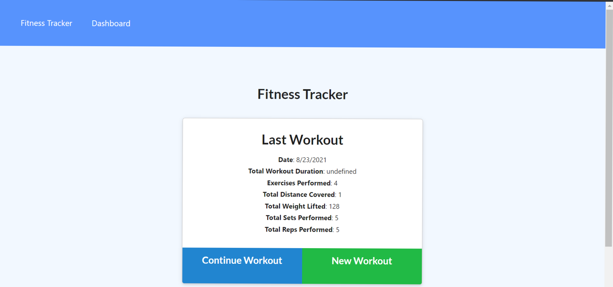
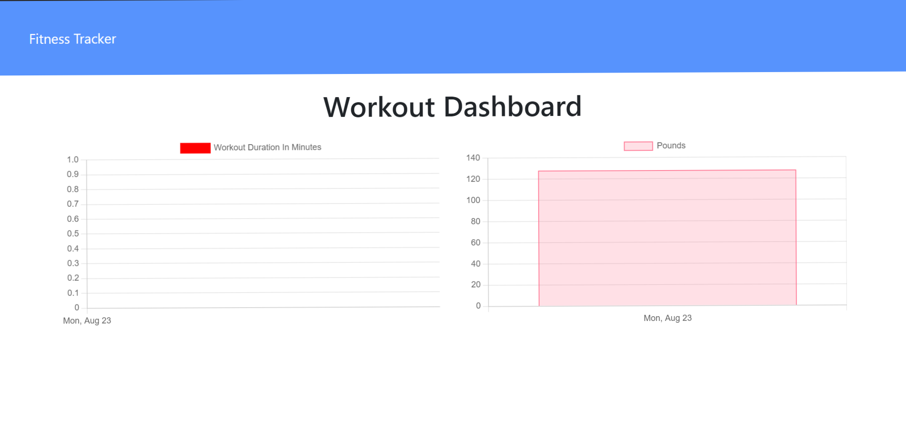

# Workout-Tracker

## Description
This project was challenging yet enlightening. I enjoyed watchung the application come together and functioning as it should, however, it was a challenge understanding which files needed changes. My motivation then became using a step by step in terms of functionality (if this works what comes next?) to resolve the missing code as I watched it unfold.

The challenges in this project allowed me to learn how to work with ease and that became following steps and not just doing what I should do to make it work. It also taught me my stengths and weaknesses as a developer. My strengths were in the back-end code and my weakness was understanding the front-end code that needs to be called in the back-end code.

Overall, this project was a fun challenge!

## Installation
Step 1: Create a Models folder with the required file, in this case I calledit Workout.js which described what was rendered on the page.

Step 2: Create a routes page that includes all GET, PUT and POST routes, and also a routes file that sends the front-end html pages thus rendering them.

Step 3: Within your server.js, ensure the right routes are being called.

Step 4: Open your integrated terminal and run npm install, then install all the necessary packages, then run the seeds file and finally node the server.js file to have it appear on the webpage.

## Usage

